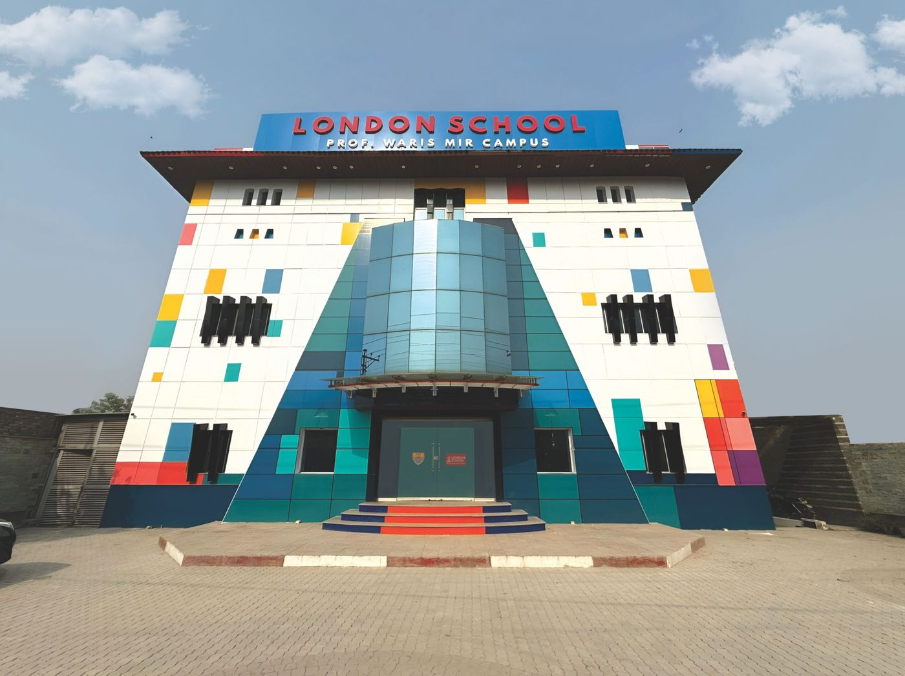

# SEO Action Plan — London School System

**Companion to:** [FULL-AUDIT-REPORT.md](FULL-AUDIT-REPORT.md)
**Overall Score:** 55 / 100 (local SEO supplementary: 41 / 100)
**Date:** 2026-04-18

Fixes are grouped by priority. Within each group, items are ordered by effort-to-impact ratio (best ratios first).

---

## CRITICAL — fix this week

These either block conversions, create trust-destroying contradictions, or leave obvious wins on the table with a 5–30 minute fix.

### C1. Fill the empty `sameAs` array in homepage schema (5 min)

**File:** [index.html:55](index.html#L55)

Replace `"sameAs": []` with:

```json
"sameAs": [
  "https://www.facebook.com/londonschoolwarismir/",
  "https://www.instagram.com/londoninternational.school/"
]
```

Connects the school entity to its verified web presence. Direct signal to Google knowledge graph and AI citation systems.

### C2. Fix the "15+ Years" contradiction (5 min)

**File:** [enroll.html](enroll.html) — stats strip

The homepage schema declares `"foundingDate": "1987"` (39 years as of 2026-04-18). The enroll stats say "15+ Years Serving Lahore Families." Change to **"Since 1987 · 39 Years Serving Lahore Families"** to resolve the contradiction and strengthen the heritage signal.

### C3. Build the missing `#contact` section on index.html (2–3 hours)

Every page's nav links to `#contact` but the anchor does not exist on the homepage. Add a `<section id="contact">` between the CTA section and the footer, containing:

- Address block (Plot #8, Sector B-2, Block 1, Ali Road, Opposite Ideal Park Township, Lahore 54600)
- Phone (0301-0499777, 042-35216426, 042-35216425)
- Email (info@londoneducation.pk)
- Office hours (Mon–Sat 8 AM – 4 PM)
- Google Maps iframe centred on the pin

This single fix addresses NAP visibility, a broken nav link, a missing Google Maps signal, and unblocks the contact conversion path. Pair with C4 for the map embed.

### C4. Enrich homepage EducationalOrganization schema (30 min)

**File:** [index.html:31-57](index.html#L31-L57) — replace the existing JSON-LD block

Additions: dual `@type`, full `address` (region + postal code), `geo`, `openingHoursSpecification` object, `priceRange`, `areaServed`, `accreditedBy` (Cambridge), `@id` anchor, `WebSite` block, populated `sameAs`.

```html
<script type="application/ld+json">
[
  {
    "@context": "https://schema.org",
    "@type": ["EducationalOrganization", "LocalBusiness"],
    "@id": "https://akifhazarvi.github.io/london-school/#organization",
    "name": "London School System",
    "alternateName": "London School — Prof. Waris Mir Campus",
    "url": "https://akifhazarvi.github.io/london-school/",
    "logo": "https://akifhazarvi.github.io/london-school/img/logo-icon.png",
    "image": "https://akifhazarvi.github.io/london-school/img/building-day.jpg",
    "description": "Pakistan's premier AI & robotics school offering Cambridge curriculum from Pre-Nursery through IGCSE with robotics lab, 25+ sports, and AI-powered learning.",
    "telephone": ["+92-301-0499777", "+92-42-35216426", "+92-42-35216425"],
    "email": "info@londoneducation.pk",
    "address": {
      "@type": "PostalAddress",
      "streetAddress": "Plot #8, Sector B-2, Block 1, Ali Road, Opposite Ideal Park Township",
      "addressLocality": "Lahore",
      "addressRegion": "Punjab",
      "postalCode": "54600",
      "addressCountry": "PK"
    },
    "geo": {
      "@type": "GeoCoordinates",
      "latitude": "31.4697",
      "longitude": "74.2728"
    },
    "openingHoursSpecification": {
      "@type": "OpeningHoursSpecification",
      "dayOfWeek": ["Monday","Tuesday","Wednesday","Thursday","Friday","Saturday"],
      "opens": "08:00",
      "closes": "16:00"
    },
    "priceRange": "PKR 15,000–22,000/month",
    "areaServed": { "@type": "City", "name": "Lahore" },
    "foundingDate": "1987",
    "founder": {
      "@type": "Person",
      "name": "Prof. Waris Mir",
      "birthDate": "1938",
      "deathDate": "1987"
    },
    "accreditedBy": {
      "@type": "Organization",
      "name": "Cambridge Assessment International Education",
      "url": "https://www.cambridgeinternational.org/"
    },
    "sameAs": [
      "https://www.facebook.com/londonschoolwarismir/",
      "https://www.instagram.com/londoninternational.school/"
    ]
  },
  {
    "@context": "https://schema.org",
    "@type": "WebSite",
    "url": "https://akifhazarvi.github.io/london-school/",
    "name": "London School System",
    "publisher": { "@id": "https://akifhazarvi.github.io/london-school/#organization" }
  }
]
</script>
```

**Before deploy:** verify the `geo` coordinates against the real Google Maps pin for the street address.

### C5. Fix placeholder faculty cards ([faculty.html](faculty.html)) (1 day — content work)

Replace every `Teacher` / `Senior Faculty` placeholder with named real teachers who have:
- Name + photo
- Subject specialism
- Qualification (B.Ed, M.A., etc.)
- Years at the school

This is the single biggest E-E-A-T win. Schools without named credentialled faculty score poorly under Google's education-specific quality rater guidelines. Pair with schema additions in H3.

### C6. Fix the dead news anchor for the Hamid Mir story ([news.html:122](news.html#L122)) (15 min)

The Hamid Mir inauguration is the site's single strongest authoritativeness signal. Currently its "Read Full Story" link points to `#`. Either:

- Build a stub article page `news/hamid-mir-inauguration.html` with the full story + photos + date, OR
- At minimum, replace the `<a>` with an expanded `<details>` block containing 200+ words of the event.

Fix the second dead anchor at [news.html:186](news.html#L186) the same way.

---

## HIGH — fix within 1 week

### H1. Add Twitter Card tags to the 8 missing pages (20 min total)

Copy these four lines from [index.html:18-21](index.html#L18-L21) and customise title/description per page in the `<head>` of: about, academics, faculty, campus, enroll, news, yearbook, ask-prof-mir.

```html
<meta name="twitter:card" content="summary_large_image">
<meta name="twitter:title" content="{PAGE TITLE}">
<meta name="twitter:description" content="{PAGE DESCRIPTION}">
<meta name="twitter:image" content="https://akifhazarvi.github.io/london-school/img/building-day.jpg">
```

### H2. Create `/llms.txt` (30 min)

Create `/Users/akif.hazarvi/londoneducation_scrape/website/llms.txt` with the full school-facts document the GEO agent drafted. Covers identity, address, phones, hours, leadership, curriculum, fees, admissions, founder bio, social. This is the single highest-ROI GEO action for AI citation.

See GEO agent output in the conversation for the full suggested content — roughly 80 lines, Markdown-formatted.

### H3. Add BreadcrumbList + page-specific schema to the 8 unschema'd pages (2–3 hours)

Schema agent produced ready-to-paste snippets. Priority order:

1. **[enroll.html](enroll.html)** — BreadcrumbList + `ItemList` of 3 `Offer` blocks (Rs. 15,000 / 18,000 / 22,000). Surfaces prices in SERP snippets.
2. **[faculty.html](faculty.html)** — BreadcrumbList + Person schema for Prof. Waris Mir (with `@id` anchoring the founder ref from homepage) + Ali Umair. Skip the unnamed "Senior Faculty" card.
3. **[news.html](news.html)** — BreadcrumbList + one NewsArticle per real event (Hamid Mir, Cultural Day, etc.) + ItemList.
4. **[academics.html](academics.html)** — BreadcrumbList + Course schema per programme (IGCSE, Robotics, Languages), each pointing to `#organization`.
5. **[about.html](about.html)** — BreadcrumbList + AboutPage. Cross-reference Prof. Waris Mir by `@id`.
6. **[campus.html](campus.html)** — BreadcrumbList + Place with `geo`.
7. **[yearbook.html](yearbook.html)** — BreadcrumbList + `CollectionPage` + `ImageGallery`.
8. **[ask-prof-mir.html](ask-prof-mir.html)** — BreadcrumbList + `SoftwareApplication` (`applicationCategory: EducationalApplication`).

Full snippets are in the schema agent transcript — paste them verbatim into each page's `<head>`.

### H4. Hardcode JS-rendered proof stats (20 min)

**Files:** [index.html](index.html) and [enroll.html](enroll.html)

`main.js` animates counters from 0 via `data-count`. Crawlers see the initial `0+`. Change:

```html
<div class="proof__num" data-count="100">0+</div>
```

to:

```html
<div class="proof__num" data-count="100">100+</div>
```

Keep `data-count` so the animation still runs; just seed the server-rendered value. **While you're there, resolve the stat mismatch:** hero trust bar says "100+ families," CLAUDE.md spec says "500+ families." Pick one number and standardise.

### H5. Fix the hero LCP image on about.html (2 min)

**File:** [about.html:168](about.html#L168)

Change `loading="lazy"` to `loading="eager" fetchpriority="high"` on the hero image. Lazy-loading the LCP candidate is actively hurting LCP.

### H6. Add `<link rel="preload">` for hero images (10 min)

**Files:** Every page with an above-fold hero image. For [index.html](index.html), add to `<head>`:

```html
<link rel="preconnect" href="https://fonts.googleapis.com">
<link rel="preconnect" href="https://fonts.gstatic.com" crossorigin>
<link rel="preload" as="image" href="img/building-day.jpg" fetchpriority="high">
```

Repeat the `preload` with the correct hero image per page.

### H7. Fix Google Fonts loading pattern (30 min)

**File:** [css/design-system.css:5](css/design-system.css#L5)

`@import url('https://fonts.googleapis.com/css2?...')` inside a CSS file creates a render-blocking waterfall. Delete the `@import` line from the CSS file and add to each HTML page's `<head>`:

```html
<link rel="preconnect" href="https://fonts.googleapis.com">
<link rel="preconnect" href="https://fonts.gstatic.com" crossorigin>
<link rel="stylesheet" href="https://fonts.googleapis.com/css2?family=Inter:wght@400;500;600;700&family=Nunito:wght@600;700;800;900&display=swap">
```

Because this repeats across 10 HTML files, consider extracting the common `<head>` block into a single shared partial if you migrate to a build tool later.

### H8. Add `width`/`height` to every `` (1 hour)

No image on any page has explicit dimensions. Chrome uses them to reserve layout space; without them, CLS scores take a hit. Measure each source image's intrinsic pixel size and add `width="..." height="..."`. CSS can continue to scale them responsively — the browser just needs the ratio.

### H9. Disallow `/london-School/` in robots.txt (2 min)

The directory at `/Users/akif.hazarvi/londoneducation_scrape/website/london-School/` contains raw WhatsApp JPEGs and MP4s (unused source material). Either delete the directory from the deploy, or add to [robots.txt](robots.txt):

```
Disallow: /london-School/
```

### H10. Fix faculty.html H1 (1 min)

**File:** [faculty.html:68](faculty.html#L68)

Change `<h1>About Us</h1>` to `<h1>Our Faculty</h1>` (or `<h1>Meet Our Teachers — London School Lahore</h1>`). Current H1 duplicates [about.html:139](about.html#L139).

### H11. Deduplicate the value cards (30 min)

The three value cards ("Curiosity First / Every Child Matters / Ready for the World") appear near-verbatim on [index.html](index.html), [about.html](about.html), and [faculty.html](faculty.html). Rewrite each page's variant to focus on that page's topic:
- `index.html` → outcomes for parents
- `about.html` → institutional history
- `faculty.html` → teaching practice

Also resolves the "We Never Stop Learning Either" duplication between [academics.html](academics.html) and [faculty.html](faculty.html).

### H12. Resolve the leadership conflict (1 hour)

[about.html:163-165](about.html#L163-L165) names **Mehr un Nisa Masood** as Principal. [faculty.html:131](faculty.html#L131) shows **Ali Umair** as Campus Director. Neither page acknowledges the other. Confirm the org chart with the school, update both pages to reflect a consistent hierarchy.

### H13. Compress the 1.75 MB faculty photo (15 min)

**File:** `img/school/faculty-staff-team.jpg`

Re-export at 1600px wide, JPEG quality 82 — target under 300 KB. Also compress `img/yearbook/campus-office.jpg` (1.0 MB → ~200 KB).

### H14. Add `poster` attribute to the academics hero videos (5 min)

**File:** [academics.html:538-545](academics.html#L538-L545)

```html
<video autoplay muted loop playsinline poster="img/robotics-lab.jpg">
```

Without a poster there is no valid LCP candidate above the fold — use an image from the existing robotics gallery.

---

## MEDIUM — fix within 1 month

### M1. Inject "Lahore" into every inner-page title + meta description

Examples:
- `<title>Admissions & Fees | Cambridge School Lahore — London School System</title>`
- `<title>Our Faculty | London School Lahore</title>`
- Meta description for [enroll.html](enroll.html): prepend "London School Lahore — Cambridge IGCSE admissions..."

Target local queries: "Cambridge school Lahore", "IGCSE school Lahore", "school near Ali Road Lahore", "school admissions Lahore 2025."

### M2. Add static FAQPage schema on [enroll.html](enroll.html) and [ask-prof-mir.html](ask-prof-mir.html)

Marked-up parent FAQ drives Google AI Overviews "People Also Ask" and Bing Copilot citations. 10 starter questions listed in GEO audit; fees, curriculum, grades, admissions process, uniform, hours, transport, language of instruction, term dates.

### M3. Trim [yearbook.html](yearbook.html) meta description

Currently 204 chars — truncates in SERPs. Trim to under 160.

### M4. Replace or redirect the `yearbook.html` slug

Page is "Virtual Tour" in title + nav but URL is `yearbook.html`. Rename to `virtual-tour.html` (preserving old file as a meta-refresh redirect to avoid breaking any existing links), update canonical + sitemap + all internal links. Targets "virtual tour Cambridge school Lahore."

### M5. Fix dead YouTube footer anchors on all 9 pages

Either create a real YouTube channel and link it, or wrap the icon as a `<span aria-hidden="true">` until a channel exists. YouTube presence is one of the strongest AI citation correlates.

### M6. Compress remaining 300–400 KB yearbook images

Six images in the 300–400 KB range (`yearbook/life-aerial-study.jpg`, `campus-building-day.jpg`, `campus-hallway-2.jpg`, etc.). Re-export at 1600px wide, quality 82. Target 150–250 KB each.

### M7. Migrate JPEGs to WebP with `<picture>` fallback

Generate `.webp` counterparts for all 71 raster images. Wrap critical hero/card images in:

```html
<picture>
  <source srcset="img/building-day.webp" type="image/webp">
  
</picture>
```

Roughly 25–35% byte savings at equivalent quality.

### M8. Defer heavy academics videos

21 MB of hero video (3 × MP4) on [academics.html](academics.html). Replace with one short loop (<5 MB) encoded with `-crf 28 -preset slow`, plus a click-to-play poster image. Users on 3G in Lahore will thank you.

### M9. Deploy Google Business Profile

Claim/verify GBP. Primary category: School. Upload 10+ photos from `img/`. Match website NAP exactly. Set hours, phones, description. Solicit reviews from current enrolled families via WhatsApp.

### M10. Add `<meta property="article:modified_time">` + schema `dateModified`

Freshness signal for AI crawlers. Also add `datePublished` to news articles once NewsArticle schema is in place.

### M11. Add `aggregateRating` markup for testimonials

Once 4+ real testimonials exist (with full names/context), mark up with `aggregateRating` to enable star display in organic results.

### M12. Add `noindex` to 404.html

```html
<meta name="robots" content="noindex, follow">
```

Prevents edge-case indexation of the error page.

### M13. Verify sitemap.xml rewrite

Sitemap agent rewrote `/sitemap.xml` during this audit (added `<lastmod>2026-04-13</lastmod>` to all 9 URLs, removed deprecated `priority`/`changefreq` tags). Run `git diff sitemap.xml` before deploying to confirm the diff matches intent.

### M14. Add image sitemap extension

For the 5–10 highest-value images (building-day, robotics-lab, campus-office, etc.) add `<image:image>` entries to `sitemap.xml` to surface in Google Images.

---

## LOW — nice to have (backlog)

- **Custom domain migration** to `londoneducation.pk` (email domain already in use). GitHub Pages URL signals a hobby/test site. A .pk custom domain materially boosts local authority.
- **PWA manifest** for "Add to Home Screen" — low effort, appreciated by parents on older Android phones.
- **IndexNow** protocol — add a key file, ping Bing/Yandex on publish.
- **Bilingual Urdu tagline / admissions form** for Urdu-primary parents.
- **Submit to Pakistan education directories** (Ilmkidunya.com, Admissionpk.com, Topschools.pk) — manual citation building with consistent NAP.
- **Wikipedia entity for the school** (long-term) — link the founder bio to the existing Prof. Waris Mir Wikipedia entry once confirmed.
- **404.html apple-touch-icon** — add for completeness.

---

## Roadmap Summary

| Week | Focus |
|-----:|-------|
| 1 | Critical (C1–C6): schema enrichment, contact section, content fixes, dead anchors |
| 2 | High performance + on-page (H1–H8): Twitter Cards, llms.txt, BreadcrumbList + page schema, stat hardcoding, LCP fixes, font loading |
| 3 | High content + authority (H9–H14): robots cleanup, H1, deduplication, leadership resolution, image compression, video posters |
| 4–5 | Medium (M1–M8): local keywords, FAQPage, slug rename, WebP conversion, video optimisation |
| 6+ | Medium (M9–M14) + Low: GBP claim, freshness signals, aggregateRating, sitemap image extension, custom domain, Urdu content, citations |

Estimated full remediation effort: **~6 weeks** at 5–8 focused hours per week. The Critical tier alone (under 4 hours of focused work including C3's contact section) will lift the health score to an estimated 68–72/100.
